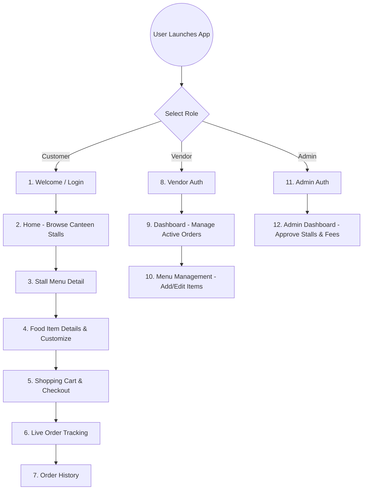

# Part II: Product Design & UX Specification (Campus Food Express)

This document contains the complete structural and design specifications for your **Campus Food Express (Foodeli)** product. You can copy these details directly into your Notion subpages for **Low-Fidelity Wireframing**, **Style Guide & Component Library**, and **HiFi Interactive Prototyping**.

---

# 📄 Subpage 1: Low-Fidelity Wireframing

A structural blueprint of **Campus Food Express (Foodeli)** mapped out across three core user roles (Customer, Vendor, and Admin). It focuses on user flows, content hierarchy, and information layouts.

## 🧭 Core App User Flows



---

## 📐 Wireframe Layout Specs (Screen by Screen)

### Screen 1: Welcome & Login Screen (Multi-Role)
*   **Header Zone**: Round placeholder for brand icon, bold text title `"Foodeli"`, subtitle `"Premium Campus Food & Fast Delivery"`.
*   **Form Card Zone**: Dropdown field for selecting role (Customer, Vendor, Admin), input fields for Name (if registering), Campus ID, Email, and Password.
*   **CTA Zone**: Solid primary action button (`"Sign In"` / `"Sign Up"`), bottom secondary text button to toggle between Login and Registration.

### Screen 2: Customer Home (Browse Stalls)
*   **Hero Banner Zone**: Slate background with student greeting (`"Good morning, [Name]"`) and notification icon badge in top-right.
*   **Search & Filter Zone**: Wide text input bar with magnifying glass icon. Horizontal scrolling row of text pills representing categories: `[Meals]`, `[Drinks]`, `[Desserts]`, `[Snacks]`.
*   **Stall Grid Zone**: Vertical list of Canteen Stall cards containing:
    *   Left side: Large square placeholder for stall logo/image.
    *   Right side: Stall Name, brief description, rating badge (`⭐ 4.8`), and delivery speed label.

### Screen 3: Canteen Stall Menu Detail
*   **Header Banner Zone**: Large cover image of the stall with back arrow floating on top left. Bottom of banner displays Stall Name, description, and status pill (`[Open]` / `"Closed"`).
*   **Category Sub-menus**: Anchor tabs to jump to categories.
*   **Food Item Card Row**: Grid cards for each food item:
    *   Top: Square image of food.
    *   Bottom: Food Item Name, Price, and a prominent gray `[+]` button to add directly to the cart.

### Screen 4: Shopping Cart & Checkout
*   **Header Zone**: Back arrow button and Page Title `"My Cart"`.
*   **Item List Zone**: Scrollable items showing selected quantity control (`[-] 1 [+]`), item name, customized additions, and price.
*   **Payment Breakdown Card**: Subtotal price, delivery fee, campus discount code input field, and total price.
*   **Checkout CTA**: Floating primary checkout button at bottom: `"Place Order - [Total Price]"`.

### Screen 5: Live Order Tracking
*   **Status Header**: Order status statement (`"Driver is picking up your food!"`).
*   **Interactive Map/Activity Indicator**: Dynamic vertical status timeline:
    *   `[✓] Order Placed`
    *   `[✓] Preparing in Canteen`
    *   `[o] Out for Delivery (Campus Express Rider)`
    *   `[ ] Delivered`
*   **Details Zone**: Stall name, ordered items, delivery room/office location.

---

# 📄 Subpage 2: Component Library & Style Guide for Branding

A unified brand system and UI element dictionary to ensure a consistent, premium user experience.

## 🎨 1. Muted Emerald & Slate Theme (Color Palette)

| Token Name | Hex Value | Purpose / Usage | Preview |
| :--- | :--- | :--- | :--- |
| **Emerald (Primary)** | `#10B981` | Core brand color, primary CTA buttons, positive alerts, and active icons. | 🟢 Emerald |
| **Midnight Navy (Header)** | `#0F172A` | Backgrounds for hero headers, top status cards, and global navigation. | 🔵 Navy |
| **Indigo (Secondary Accent)**| `#6366F1` | Accent buttons, category badges, and special promotions. | 🟣 Indigo |
| **Text Primary (Dark)** | `#0D121B` | High-contrast headers, input titles, and primary content labels. | ⚫ Charcoal |
| **Text Secondary (Muted)**| `#7D8B9B` | Slate gray for secondary text, placeholder labels, and timestamps. | ⚪ Muted Slate|
| **Background (Light)** | `#F5F6F6` | General page backdrops, inactive card fields, and background fills. | ⚪ Cool White |

## 🅰️ 2. Typography Hierarchy

*   **Font Family**: `Roboto` or `Inter` (Sans-serif, modern, readable).
*   **App Logo Title**: `34px Bold`, Letter spacing `-1.0px` (used for Welcome/Login branding).
*   **Header 1 (Main Headings)**: `22px Bold`, Letter spacing `-0.5px` (used for page titles, card headers).
*   **Header 2 (Sub-Headings)**: `18px Semi-Bold` (used for stall category titles).
*   **Body Text Primary**: `14px Medium` (used for item names, description fields).
*   **Body Text Muted**: `13px Light/Regular` (used for times, reviews, descriptions).

---

## 🧩 3. Interactive Component Dictionary

### Button Library

```
[ Primary CTA Button ]  --> Solid background (#10B981), rounded-corners (18px), white text, padding (20px vertical).
[ Pill Select Filter ]  --> Filled active pill (#10B981 with white text) or light inactive pill (#F5F6F6 with #7D8B9B text).
[ Quantity Selector ]   --> Row containing circle minus (-), count number, circle plus (+).
```

### Input Field Component
*   **Container**: Height `56px`, Background Color `#F5F6F6`, Border-radius `16px`.
*   **States**:
    *   *Default*: No border, Slate grey icon (`#7D8B9B`) on the left, light grey placeholder text.
    *   *Active/Focused*: Border width `1.5px` colored Solid Emerald (`#10B981`), focus indicator.

### Card Components
*   **Canteen Stall Card**: Solid white background, rounded corner border-radius `28px`, subtle shadow blur `20px` with 2% opacity black.
*   **Bottom Navigation Bar (Foodeli Bar)**: Floating bar height `80px`, background `#FFFFFF`, shadow blur `18px`, holding 4 active/inactive icons. Active items expand horizontally with an emerald background pill.

---

# 📄 Subpage 3: HiFi Interactive Prototyping

This section maps out how to convert the low-fidelity layout structure into the final, high-fidelity **Campus Food Express (Foodeli)** playable prototype in Figma.

## ⚡ Interactive Transition Map (Figma Connections)

| Starting Element | Trigger Event | Animation Type | Target Screen |
| :--- | :--- | :--- | :--- |
| **Welcome "Sign In" Button** | `On Tap` | Slide In (300ms, Ease Out) | Customer Home Screen / Stall Dashboard |
| **Canteen Stall Card** | `On Tap` | Smart Animate (400ms, Ease Out) | Canteen Stall Menu Page |
| **Food Item Card "+" Icon** | `On Tap` | Instant / Update Badge | Cart Controller Increments (1 Item Added) |
| **Cart Bottom Nav Icon** | `On Tap` | Dissolve (200ms) | Shopping Cart Page |
| **"Place Order" Checkout Button** | `On Tap` | Smart Animate (500ms) | Order Status Page (Live Tracking) |
| **Stall Status Toggle (Vendor)** | `On Tap` | Smart Animate (250ms) | Online / Offline Status Change |

---

## 🛠️ Figma-to-Notion Handoff Checklist
To place this interactive mock inside Notion:

1.  **Run Figma Prototype**: Click **Present (Play)** in Figma.
2.  **Generate Embed Link**: Click **Share Prototype** in the top right > Set permissions to **"Anyone with the link can view"** > Click **Copy Link**.
3.  **Embed in Notion**: In your Notion `"HiFi Interactive Prototyping"` subpage, type `/embed`, paste the Presentation URL, and click **Embed Link**.
4.  **Aesthetic Polish**: Resize the Notion block window to a standard **iPhone container aspect ratio (e.g. Width 393px, Height 852px)** so the prototype fits perfectly.
